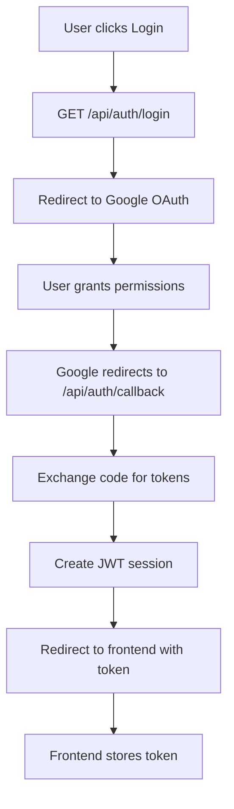
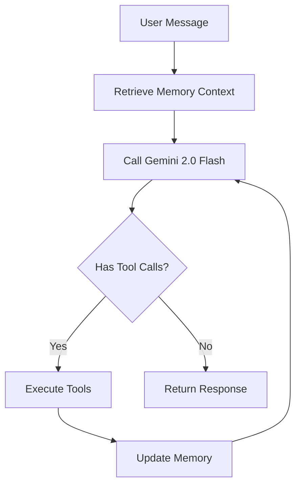

# Cortex Agent - Complete Project Documentation

## Table of Contents

1. [Project Overview](#project-overview)
2. [Architecture](#architecture)
3. [Project Structure](#project-structure)
4. [File Inventory](#file-inventory)
5. [API Endpoints](#api-endpoints)
6. [Database Schema](#database-schema)
7. [Services](#services)
8. [Infrastructure](#infrastructure)
9. [CI/CD Pipeline](#cicd-pipeline)
10. [Environment Variables](#environment-variables)
11. [Workflows](#workflows)
12. [Features](#features)
13. [Tech Stack](#tech-stack)

---

## Project Overview

**Cortex Agent** is a personal AI assistant (Chief of Staff) that integrates with Google Workspace (Gmail & Calendar) and uses advanced AI for intelligent decision-making. It maintains dynamic memory of user preferences and extracted facts.

### Key Details

| Attribute | Value |
|-----------|-------|
| **Project Name** | Cortex Agent |
| **Type** | Personal AI Assistant |
| **Deadline** | January 24th, 2026 |
| **Target Submission** | January 22nd (2 days early for bonus) |
| **Budget** | ~$10-15/month AWS costs |
| **Repository** | https://github.com/Subash-Saajan/cortex_agent |
| **AWS Account** | 045230654519 |
| **Region** | us-east-1 |

---

## Architecture

### Current Architecture

```
┌─────────────────────────────────────────┐
│  CloudFront (HTTPS Frontend)            │
│  https://d3ouv9vt88djdf.cloudfront.net  │
└────────────────┬────────────────────────┘
                 │ HTTPS
                 ▼
┌─────────────────────────────────────────┐
│  Application Load Balancer (HTTPS)      │
│  https://api.cortex.subashsaajan.site   │
│  ACM Certificate for api.cortex...      │
└────────────────┬────────────────────────┘
                 │
                 ▼
┌─────────────────────────────────────────┐
│  ECS Fargate Service (Backend)          │
│  FastAPI + LangGraph + Gemini 2.0 Flash │
│  Private IP (routed via ALB)            │
└────────────────┬────────────────────────┘
                 │
                 ▼
┌──────────────────────────────────────────┐
│  RDS PostgreSQL (cortexdb)               │
│  cortex-agent-db.cafuw86ac9wv.us-east-1.rds.amazonaws.com:5432
└──────────────────────────────────────────┘
```

### Hosting Configuration

| Service | Hosting Platform | URL | HTTPS |
|---------|-----------------|-----|-------|
| Frontend | S3 + CloudFront | https://d3ouv9vt88djdf.cloudfront.net | ✅ Default cert |
| Backend | ECS Fargate + ALB | https://api.cortex.subashsaajan.site | ✅ ACM cert |
| Database | RDS PostgreSQL | Internal | Internal |

**Note:** Frontend is hosted on **S3 + CloudFront** (static export), NOT Vercel.
Backend is already behind an **ALB with ACM certificate** for HTTPS.

### Agent Architecture

```
User Message → Memory Context Retrieval → Gemini 2.0 Flash Processing →
Fact Extraction → Storage → Response Return
```

---

## Project Structure

```
CortexAgent/
├── backend/                           # FastAPI backend
│   ├── app/
│   │   ├── main.py                   # FastAPI application entry point
│   │   ├── agent/
│   │   │   ├── graph.py              # LangGraph agent workflow
│   │   │   └── __init__.py
│   │   ├── api/
│   │   │   ├── routes.py             # Basic chat route
│   │   │   ├── chat.py               # Chat API router
│   │   │   ├── auth.py               # Google OAuth authentication
│   │   │   ├── integrations.py       # Gmail/Calendar integrations
│   │   │   └── __init__.py
│   │   ├── services/
│   │   │   ├── memory_service.py     # Memory extraction and retrieval
│   │   │   ├── gmail_service.py      # Gmail API integration
│   │   │   ├── calendar_service.py   # Google Calendar API integration
│   │   │   └── __init__.py
│   │   ├── db/
│   │   │   ├── database.py           # PostgreSQL connection
│   │   │   ├── models.py             # SQLAlchemy models
│   │   │   └── __init__.py
│   │   └── __init__.py
│   ├── requirements.txt              # Python dependencies
│   ├── Dockerfile                    # Backend container configuration
│   └── .env.example                  # Environment variables template
│
├── frontend/                          # Next.js frontend
│   ├── src/
│   │   ├── pages/
│   │   │   ├── index.tsx             # Main chat interface with OAuth
│   │   │   ├── _app.tsx              # App wrapper
│   │   │   └── api/                  # API routes
│   │   ├── components/               # React components
│   │   ├── styles/
│   │   │   └── globals.css           # Global styles
│   │   └── lib/                      # Utility functions
│   ├── public/                       # Static assets
│   ├── out/                          # Static export output
│   ├── package.json                  # Node.js dependencies
│   ├── next.config.js                # Next.js configuration
│   ├── tsconfig.json                 # TypeScript configuration
│   ├── Dockerfile                    # Frontend container configuration
│   └── .env.example                  # Environment variables template
│
├── terraform/                         # AWS Infrastructure as Code
│   ├── main.tf                       # VPC, ECS, security groups, ECR
│   ├── rds.tf                        # PostgreSQL database
│   ├── s3_cloudfront.tf              # Frontend hosting (S3 + CloudFront)
│   ├── alb.tf                        # Application Load Balancer
│   ├── variables.tf                  # Input variables
│   ├── terraform.tfvars              # Configuration values
│   ├── terraform.tfvars.example      # Template
│   ├── outputs.tf                    # Output values
│   ├── terraform.tfstate             # Terraform state
│   ├── terraform.tfstate.backup      # State backup
│   ├── terraform.lock.hcl            # Provider lock file
│   ├── tfplan                        # Terraform plan output
│   └── ALB_DEPLOYMENT_GUIDE.md       # ALB setup documentation
│
├── .github/
│   └── workflows/
│       └── deploy.yml                # GitHub Actions CI/CD pipeline
│
├── .claude/
│   └── settings.local.json           # Claude AI settings
│
├── .git/                             # Git repository
├── docker-compose.yml                # Local development setup
├── deploy.sh                         # Deployment script
├── README.md                         # Project documentation
├── IMPLEMENTATION_PLAN.md            # Detailed implementation plan
├── PROJECT_STATUS.md                 # Current project status
├── CURRENT_STATUS_AND_NEXT_STEPS.md  # Recent updates
├── DEPLOYMENT_SETUP.md               # Deployment instructions
├── DEPLOYMENT_STATUS.md              # Deployment status
├── FINAL_CHECKLIST.md                # Submission checklist
├── NEXT_STEPS.md                     # Next action items
├── YOUR_ACTION_REQUIRED.md           # Action items
├── Sentellent Hiring Challenge.pdf   # Challenge document
├── check_env.py                      # Environment check script
├── check_models.py                   # Models check script
├── migrate_db.py                     # Database migration script
├── test_db_connection.py             # Database connection test
├── list_available_models.py          # List available AI models
├── list_models_direct.py             # List models directly
├── task_arn.txt                      # ECS task ARN
└── .gitignore                        # Git ignore rules
```

---

## File Inventory

### Root Level Files

| File | Purpose |
|------|---------|
| `README.md` | Project overview and setup instructions |
| `IMPLEMENTATION_PLAN.md` | Detailed 9-day implementation timeline |
| `PROJECT_STATUS.md` | Current project status and milestones |
| `CURRENT_STATUS_AND_NEXT_STEPS.md` | Recent updates and next steps |
| `DEPLOYMENT_SETUP.md` | AWS deployment configuration |
| `DEPLOYMENT_STATUS.md` | Current deployment status |
| `FINAL_CHECKLIST.md` | Pre-submission checklist |
| `NEXT_STEPS.md` | Action items for completion |
| `YOUR_ACTION_REQUIRED.md` | Required user actions |
| `docker-compose.yml` | Local development environment |
| `deploy.sh` | Deployment automation script |
| `.gitignore` | Git ignore patterns |
| `check_env.py` | Environment validation script |
| `check_models.py` | AI models check |
| `migrate_db.py` | Database migrations |
| `test_db_connection.py` | Database connectivity test |
| `list_available_models.py` | List available AI models |
| `list_models_direct.py` | Direct model listing |
| `task_arn.txt` | ECS task ARN storage |
| `Sentellent Hiring Challenge.pdf` | Challenge requirements |

### Backend Files

| File | Purpose |
|------|---------|
| `backend/app/main.py` | FastAPI application with lifespan, CORS, routers |
| `backend/app/agent/graph.py` | LangGraph ReAct agent with Gemini 2.0 Flash |
| `backend/app/api/routes.py` | Basic chat route |
| `backend/app/api/chat.py` | Chat API router |
| `backend/app/api/auth.py` | Google OAuth authentication |
| `backend/app/api/integrations.py` | Gmail/Calendar integration endpoints |
| `backend/app/services/memory_service.py` | Memory extraction, storage, and retrieval |
| `backend/app/services/gmail_service.py` | Gmail API operations |
| `backend/app/services/calendar_service.py` | Google Calendar API operations |
| `backend/app/db/database.py` | PostgreSQL async connection |
| `backend/app/db/models.py` | SQLAlchemy models (User, ChatMessage, MemoryFact, MemoryEmbedding) |
| `backend/requirements.txt` | Python dependencies |
| `backend/Dockerfile` | Backend container image |
| `backend/.env.example` | Backend environment template |

### Frontend Files

| File | Purpose |
|------|---------|
| `frontend/src/pages/index.tsx` | Main chat interface with OAuth login |
| `frontend/src/pages/_app.tsx` | Next.js app wrapper |
| `frontend/src/styles/globals.css` | Global styles with glassmorphism |
| `frontend/package.json` | Node.js dependencies |
| `frontend/next.config.js` | Next.js configuration (static export) |
| `frontend/tsconfig.json` | TypeScript configuration |
| `frontend/next-env.d.ts` | Next.js TypeScript declarations |
| `frontend/Dockerfile` | Frontend container image |
| `frontend/.env.example` | Frontend environment template |
| `frontend/out/` | Static export output directory |

### Terraform Files

| File | Purpose |
|------|---------|
| `terraform/main.tf` | VPC, subnets, ECS, ECR, security groups |
| `terraform/rds.tf` | PostgreSQL RDS instance |
| `terraform/s3_cloudfront.tf` | S3 bucket + CloudFront distribution |
| `terraform/alb.tf` | Application Load Balancer |
| `terraform/variables.tf` | Input variable definitions |
| `terraform/terraform.tfvars` | Configuration values |
| `terraform/terraform.tfvars.example` | Template |
| `terraform/outputs.tf` | Output values |
| `terraform/terraform.tfstate` | Terraform state |
| `terraform/terraform.tfstate.backup` | State backup |
| `terraform/terraform.lock.hcl` | Provider lock file |
| `terraform/ALB_DEPLOYMENT_GUIDE.md` | ALB setup documentation |

### CI/CD Files

| File | Purpose |
|------|---------|
| `.github/workflows/deploy.yml` | GitHub Actions deployment pipeline |
| `.github/workflows/` | GitHub Actions workflows directory |

### Git Configuration

| File | Purpose |
|------|---------|
| `.git/config` | Git configuration |
| `.git/HEAD` | Current branch reference |
| `.git/index` | Staging area |
| `.git/refs/heads/main` | Main branch reference |
| `.git/refs/remotes/origin/main` | Remote branch reference |
| `.git/description` | Repository description |
| `.git/COMMIT_EDITMSG` | Commit message template |
| `.git/FETCH_HEAD` | Fetched references |
| `.git/ORIG_HEAD` | Original HEAD before operations |
| `.git/info/exclude` | Additional exclude patterns |
| `.git/hooks/` | Git hooks |

---

## API Endpoints

### Authentication Endpoints

| Method | Endpoint | Description |
|--------|----------|-------------|
| GET | `/api/auth/login` | Initiates Google OAuth flow |
| GET | `/api/auth/callback` | Handles OAuth callback |
| GET | `/api/auth/verify/{user_id}` | Verifies user session |

### Chat Endpoints

| Method | Endpoint | Description |
|--------|----------|-------------|
| POST | `/api/chat` | Send message to agent |
| GET | `/api/chat/history/{user_id}` | Get chat history |

### Gmail Endpoints

| Method | Endpoint | Description |
|--------|----------|-------------|
| GET | `/api/gmail/inbox/{user_id}` | Fetch recent emails |
| POST | `/api/gmail/send` | Send email via Gmail API |

### Calendar Endpoints

| Method | Endpoint | Description |
|--------|----------|-------------|
| GET | `/api/calendar/events/{user_id}` | Get upcoming events |
| POST | `/api/calendar/create` | Create calendar event |

### Health Endpoints

| Method | Endpoint | Description |
|--------|----------|-------------|
| GET | `/health` | Health check |

---

## Database Schema

### Users Table

| Column | Type | Description |
|--------|------|-------------|
| id | UUID | Primary key |
| email | String(255) | User email (unique) |
| name | String(255) | User display name |
| google_id | String(255) | Google OAuth ID (unique) |
| refresh_token | Text | Google refresh token |
| created_at | DateTime | Creation timestamp |
| updated_at | DateTime | Last update timestamp |

### ChatMessages Table

| Column | Type | Description |
|--------|------|-------------|
| id | UUID | Primary key |
| user_id | UUID | Foreign key to users |
| role | String(50) | "user" or "assistant" |
| content | Text | Message content |
| created_at | DateTime | Creation timestamp |

### MemoryFacts Table

| Column | Type | Description |
|--------|------|-------------|
| id | UUID | Primary key |
| user_id | UUID | User identifier (indexed) |
| fact | Text | Extracted fact |
| category | String(50) | preference, habit, project, relationship, constraint, event, personal |
| importance | Float | 0.0 to 1.0 importance score |
| metadata_json | Text | JSON metadata |
| created_at | DateTime | Creation timestamp |
| updated_at | DateTime | Last update timestamp |

### MemoryEmbeddings Table

| Column | Type | Description |
|--------|------|-------------|
| id | UUID | Primary key |
| memory_fact_id | UUID | Foreign key to memory_facts |
| embedding | Vector(768) | Google embedding-001 vector |
| created_at | DateTime | Creation timestamp |

---

## Services

### MemoryService

**Purpose:** Manages user memory with semantic search using pgvector

**Key Methods:**

| Method | Description |
|--------|-------------|
| `extract_facts()` | Extracts facts from user messages using Gemini |
| `store_fact()` | Stores fact with vector embedding |
| `search_semantic_memories()` | Searches memories using pgvector L2 distance |
| `retrieve_relevant_facts()` | Hybrid search (semantic + importance) |
| `get_memory_context()` | Gets formatted memory context for agent |
| `get_constraint_context()` | Gets constraints/preferences for email drafting |

### GmailService

**Purpose:** Gmail API integration

**Key Methods:**

| Method | Description |
|--------|-------------|
| `get_service()` | Gets authenticated Gmail service |
| `get_inbox()` | Fetches recent emails |
| `send_email()` | Sends email via Gmail API |
| `get_attachment()` | Extracts text from PDF attachments |
| `get_message_with_attachments()` | Gets full message with attachments |

### CalendarService

**Purpose:** Google Calendar API integration

**Key Methods:**

| Method | Description |
|--------|-------------|
| `get_service()` | Gets authenticated Calendar service |
| `get_events()` | Fetches upcoming calendar events |
| `create_event()` | Creates new calendar event |

### Agent (LangGraph)

**Purpose:** AI agent with tool calling capabilities

**Tools:**

| Tool | Description |
|------|-------------|
| `search_emails` | Search for relevant emails |
| `get_calendar_events` | Get upcoming events |
| `search_memory` | Search long-term memory |
| `save_memory` | Save important facts |
| `draft_and_send_email` | Draft and send emails |

---

## Infrastructure

### VPC Configuration

| Component | Value |
|-----------|-------|
| VPC CIDR | 10.0.0.0/16 |
| Public Subnets | 2 (10.0.1.0/24, 10.0.2.0/24) |
| Availability Zones | 2 |

### ECS Configuration

| Component | Value |
|-----------|-------|
| Cluster | cortex-agent-cluster |
| Service | cortex-agent-service |
| Launch Type | FARGATE |
| CPU | 256 (0.25 vCPU) |
| Memory | 512 MB |
| Network Mode | awsvpc |
| Public IP | False (behind ALB) |
| Load Balancer | ALB target group |

### Application Load Balancer

| Component | Value |
|-----------|-------|
| Name | cortex-agent-alb |
| Type | Application Load Balancer |
| Scheme | Internet-facing |
| DNS Name | Available in terraform outputs |
| ACM Certificate | api.cortex.subashsaajan.site |

### RDS Configuration

| Component | Value |
|-----------|-------|
| Engine | PostgreSQL |
| Instance Class | db.t3.micro |
| Storage | 20 GB |
| Database Name | cortexdb |
| Username | postgres |
| Publicly Accessible | Yes |

### ECR Repositories

| Repository | Description |
|------------|-------------|
| cortex-agent-backend | Backend Docker images |
| cortex-agent-frontend | Frontend Docker images |

### CloudFront

| Component | Value |
|-----------|-------|
| Distribution ID | E3542HOBM2OPAR |
| Domain | d3ouv9vt88djdf.cloudfront.net |

### S3

| Component | Value |
|-----------|-------|
| Bucket | cortex-agent-frontend-045230654519 |

---

## CI/CD Pipeline

### Workflow: Build and Deploy to AWS

**Triggers:** Push to main/master branch

**Environment Variables:**

```yaml
AWS_REGION: us-east-1
AWS_ACCOUNT_ID: 045230654519
ECR_BACKEND_REPO: cortex-agent-backend
ECS_CLUSTER: cortex-agent-cluster
ECS_SERVICE: cortex-agent-service
S3_BUCKET: cortex-agent-frontend-045230654519
CLOUDFRONT_DIST_ID: E3542HOBM2OPAR
```

**Jobs:**

1. **Checkout** - Code checkout
2. **Configure AWS Credentials** - AWS authentication
3. **Login to Amazon ECR** - Docker registry login
4. **Build Backend Image** - Build and push backend to ECR
5. **Render Task Definition** - Update task definition with new image
6. **Deploy to ECS** - Update ECS service
7. **Build Frontend** - Static export build
8. **Deploy to S3** - Sync frontend to S3
9. **Invalidate CloudFront** - Clear CDN cache

---

## Environment Variables

### Backend (.env)

| Variable | Description |
|----------|-------------|
| `DATABASE_URL` | PostgreSQL connection string |
| `GOOGLE_CLIENT_ID` | Google OAuth client ID |
| `GOOGLE_CLIENT_SECRET` | Google OAuth client secret |
| `GOOGLE_REDIRECT_URI` | OAuth callback URL |
| `GOOGLE_API_KEY` | Google Gemini API key |
| `ANTHROPIC_API_KEY` | Claude API key (fallback) |
| `JWT_SECRET` | JWT signing secret |

### Frontend (.env.local)

| Variable | Description |
|----------|-------------|
| `NEXT_PUBLIC_BACKEND_URL` | Backend API URL |

### Terraform (terraform.tfvars)

| Variable | Description |
|----------|-------------|
| `aws_region` | AWS region |
| `db_password` | PostgreSQL password |
| `google_client_id` | Google OAuth client ID |
| `google_client_secret` | Google OAuth client secret |
| `google_redirect_uri` | OAuth callback URL |
| `google_api_key` | Google Gemini API key |
| `claude_api_key` | Claude API key |
| `jwt_secret` | JWT signing secret |

---

## Workflows

### Local Development Workflow

```bash
# Start all services
docker-compose up --build

# Services available at:
# - Frontend: http://localhost:3000
# - Backend API: http://localhost:8000
# - Database: localhost:5432
```

### AWS Deployment Workflow

```bash
# 1. Configure Terraform
cd terraform
cp terraform.tfvars.example terraform.tfvars
# Edit terraform.tfvars

# 2. Initialize Terraform
terraform init

# 3. Plan deployment
terraform plan

# 4. Apply configuration
terraform apply

# 5. Build and push Docker images
docker build -t cortex-agent-backend:latest ./backend
aws ecr get-login-password --region us-east-1 | docker login --username AWS --password-stdin <ACCOUNT_ID>.dkr.ecr.us-east-1.amazonaws.com
docker tag cortex-agent-backend:latest <ACCOUNT_ID>.dkr.ecr.us-east-1.amazonaws.com/cortex-agent-backend:latest
docker push <ACCOUNT_ID>.dkr.ecr.us-east-1.amazonaws.com/cortex-agent-backend:latest

# 6. Trigger ECS update
aws ecs update-service --cluster cortex-agent-cluster --service cortex-agent-service --force-new-deployment --region us-east-1
```

### CI/CD Workflow (GitHub Actions)

```yaml
on:
  push:
    branches: [main, master]

# Automatic pipeline:
# 1. Checkout code
# 2. Configure AWS credentials
# 3. Login to ECR
# 4. Build and push backend image
# 5. Update ECS task definition
# 6. Deploy to ECS
# 7. Build frontend (static export)
# 8. Deploy to S3
# 9. Invalidate CloudFront cache
```

### OAuth Flow



### Agent Interaction Flow



---

## Features

### Completed Features

| Feature | Status | Description |
|---------|--------|-------------|
| AWS Infrastructure | ✅ Complete | VPC, ECS, RDS, ECR |
| CI/CD Pipeline | ✅ Complete | GitHub Actions automated deployment |
| FastAPI Backend | ✅ Complete | REST API with CORS and error handling |
| Next.js Frontend | ✅ Complete | Responsive UI with glassmorphism |
| Google OAuth | ✅ Complete | Authentication with JWT tokens |
| Gmail Integration | ✅ Complete | Read emails, send emails, PDF extraction |
| Calendar Integration | ✅ Complete | List events, create events |
| LangGraph Agent | ✅ Complete | ReAct pattern with Gemini 2.0 Flash |
| Semantic Memory | ✅ Complete | pgvector embeddings with hybrid search |
| Dynamic Memory Extraction | ✅ Complete | AI-powered fact extraction |

### Frontend Features

| Feature | Description |
|---------|-------------|
| Dark Mode UI | Glassmorphism design with dark theme |
| OAuth Login | Google authentication |
| Chat Interface | Real-time messaging with agent |
| Email Drafting | Draft and send emails |
| Loading States | Typing indicators |
| Error Handling | User-friendly error messages |

### Agent Capabilities

| Capability | Description |
|------------|-------------|
| Chat | Natural language conversation |
| Email Search | Search through Gmail |
| Email Sending | Draft and send emails |
| Calendar Management | View and create events |
| Memory Extraction | Auto-extract facts from conversations |
| Memory Retrieval | Semantic search with pgvector |

---

## Tech Stack

### Frontend

| Technology | Version | Purpose |
|------------|---------|---------|
| Next.js | ^14.0.0 | React framework |
| React | ^18.2.0 | UI library |
| Axios | ^1.6.0 | HTTP client |
| TypeScript | - | Type safety |
| CSS | - | Styling with glassmorphism |

### Backend

| Technology | Version | Purpose |
|------------|---------|---------|
| FastAPI | 0.115.6 | Web framework |
| Python | 3.11 | Runtime |
| Uvicorn | 0.34.0 | ASGI server |
| Pydantic | 2.10.6 | Data validation |
| SQLAlchemy | 2.0.23 | ORM |
| asyncpg | 0.29.0 | Async PostgreSQL driver |

### AI & Machine Learning

| Technology | Version | Purpose |
|------------|---------|---------|
| LangGraph | 0.2.45 | Agent framework |
| LangChain | 0.3.13 | LLM framework |
| langchain-google-genai | 2.0.0 | Google Gemini integration |
| Google Generative AI | - | Gemini 2.0 Flash |
| pgvector | 0.2.4 | Vector embeddings |

### Database

| Technology | Version | Purpose |
|------------|---------|---------|
| PostgreSQL | 15 | Primary database |
| pgvector | 0.2.4 | Vector similarity search |

### Google APIs

| Technology | Purpose |
|------------|---------|
| Gmail API | Email access and sending |
| Calendar API | Calendar management |
| OAuth 2.0 | Authentication |

### Infrastructure

| Technology | Purpose |
|------------|---------|
| Docker | Containerization |
| Docker Compose | Local development |
| Terraform | Infrastructure as Code |
| AWS ECS Fargate | Container orchestration |
| AWS RDS | Managed PostgreSQL |
| AWS ECR | Container registry |
| AWS S3 | Static hosting |
| AWS CloudFront | CDN |
| AWS ALB | Load balancing |
| GitHub Actions | CI/CD |

---

## Key Files Reference

### Core Application Files

| File | Lines | Purpose |
|------|-------|---------|
| `backend/app/main.py` | 123 | FastAPI app with lifespan, CORS, error handling |
| `backend/app/agent/graph.py` | 213 | LangGraph agent with ReAct pattern |
| `backend/app/services/memory_service.py` | 265 | Memory extraction and semantic search |
| `backend/app/services/gmail_service.py` | 200 | Gmail API integration |
| `frontend/src/pages/index.tsx` | 318 | Main chat interface with OAuth |
| `terraform/main.tf` | 314 | VPC, ECS, ECR, security groups |
| `.github/workflows/deploy.yml` | 89 | CI/CD pipeline |

---

## Deployment URLs

| Service | URL |
|---------|-----|
| Frontend (CloudFront) | https://d3ouv9vt88djdf.cloudfront.net |
| Backend (ALB HTTPS) | https://api.cortex.subashsaajan.site |
| Health Check | https://api.cortex.subashsaajan.site/health |

---

## Timeline

| Phase | Days | Status |
|-------|------|--------|
| Infrastructure & CI/CD | 1-2 | ✅ Complete |
| Core Agent & Memory | 3-4 | ✅ Complete |
| Google Integration | 5-6 | ✅ Complete |
| Frontend & Testing | 7-9 | 📝 In Progress |
| Submission Deadline | 24 Jan | 9 days left |
| Target Submission | 22 Jan | 2 days early |

---

## Success Criteria

### Minimum (Phase 1)
- Working chat agent deployed on AWS
- Terraform + CI/CD pipeline
- Competitive submission

### Strong (Phase 1 + 2)
- Google OAuth authentication
- Gmail + Calendar integration
- Complete solution with all core features

### Excellent (Phase 1 + 2 + 3)
- Dynamic memory extraction
- Semantic search with pgvector
- Advanced implementation showing contextual intelligence

### Bonus Points
- Submit 2 days early (January 22nd)
- Clean code and good engineering practices

---

## Estimated Monthly Costs

| Resource | Monthly Cost |
|----------|--------------|
| ECS Fargate (0.25 vCPU, 512MB) | ~$10 |
| RDS db.t3.micro (free tier) | $0 (first 12 months) |
| Application Load Balancer | ~$16-18 |
| ECR + CloudWatch | ~$2 |
| **Total** | **~$28-31/month** |

**Note:** ALB is already deployed and required for HTTPS backend access.

---

## Resources & References

- [FastAPI Docs](https://fastapi.tiangolo.com/)
- [LangGraph Docs](https://langchain-ai.github.io/langgraph/)
- [Google Gemini API](https://ai.google.dev/docs)
- [Google OAuth Setup](https://developers.google.com/identity/protocols/oauth2)
- [Gmail API Docs](https://developers.google.com/gmail/api)
- [Calendar API Docs](https://developers.google.com/calendar)
- [Terraform AWS Docs](https://registry.terraform.io/providers/hashicorp/aws/latest/docs)
- [pgvector for PostgreSQL](https://github.com/pgvector/pgvector)
- [Next.js Export (Static)](https://nextjs.org/docs/advanced-features/static-html-export)

---

## Key Success Tips

1. **Start with infrastructure** - Terraform + CI/CD first, features second
2. **Deploy early** - Get "Hello World" live by Day 2, catch issues early
3. **Use AI to your advantage** - Claude, ChatGPT for boilerplate code
4. **Test incrementally** - Each phase should be tested on live AWS
5. **Keep it simple** - No fancy UI, focus on clean code + working features
6. **Memory is the highlight** - Dynamic memory extraction + retrieval is special
7. **Submit early** - January 22nd gets bonus points

---

**Last Updated:** January 17, 2026
**Project Status:** 🚀 Agent Upgrade Complete, Premium UI Live
